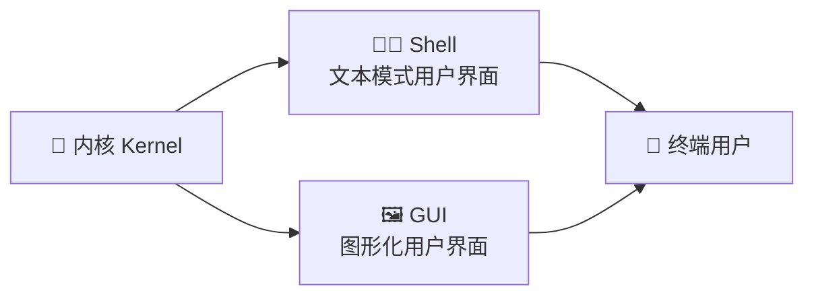

## 🎯 典型 Shell 快速入口

全部 5 个 Linux/Windows Shell 全部平铺可点击！

| Shell | 平台 | 类型 | 核心价值 | 分卷文档 |
| :--- | :--- | :--- | :--- | --- |
| [Bash](/products/bash/) 💻 | Linux/macOS | GNU Shell | POSIX 标准参考实现、默认命令行环境、脚本万能钥匙 | [查看详情](/products/bash/) → |
| [zsh](/products/zsh/) 🐚 | Linux/macOS | Enhanced Bash | 插件系统 (Oh My Zsh)、自动纠错、补全增强、主题美化 | [查看详情](/products/zsh/) → |
| [fish](/products/fish/) 🐟 | Linux/macOS | Friendly Shell | 语法最简洁、交互体验最佳、新手友好、智能提示 | [查看详情](/products/fish/) → |
| [cmd](/products/cmd/) 💿 | Windows | Legacy CLI | Windows 传统命令行、批处理脚本 (.bat/.cmd)、兼容性最强 | [查看详情](/products/cmd/) → |
| [PowerShell](/products/powershell/) ☁️ | Windows/macOS/Linux | Object Pipeline | 面向对象管道、强大对象操作、跨平台 (Core 7+)、自动化神器 | [查看详情](/products/powershell/) → |

<div class="grid-container" style="display: grid; grid-template-columns: repeat(auto-fit, minmax(280px, 1fr)); gap: 16px; margin-top: 24px;">

<a href="/matrix/experiment/" style="text-decoration: none;">
  <div style="background: var(--vp-c-bg-soft); border: 1px solid var(--vp-c-divider); padding: 20px; border-radius: 12px; height: 100%; transition: all 0.3s ease;">
    <h3 style="margin: 0 0 8px 0; color: var(--vp-c-brand-1);">📝 9 个统一任务实验手册</h3>
    <p style="margin: 0; font-size: 0.875rem; color: var(--vp-c-text-2);">env 环境指纹 → hello_io → variables_quoting → args_parsing → control_flow → functions_scope → pipes_files → errors → real_world 完整批处理流水线</p>
  </div>
</a>

<a href="/matrix/" style="text-decoration: none;">
  <div style="background: var(--vp-c-bg-soft); border: 1px solid var(--vp-c-divider); padding: 20px; border-radius: 12px; height: 100%; transition: all 0.3s ease;">
    <h3 style="margin: 0 0 8px 0; color: var(--vp-c-brand-1);">⚖️ 5 大横向对比矩阵</h3>
    <p style="margin: 0; font-size: 0.875rem; color: var(--vp-c-text-2);">入参模型、引号语义、通配匹配、错误处理、可移植性五大维度深度对比表</p>
  </div>
</a>

<a href="/compare/shell-vs-python" style="text-decoration: none;">
  <div style="background: var(--vp-c-bg-soft); border: 1px solid var(--vp-c-divider); padding: 20px; border-radius: 12px; height: 100%; transition: all 0.3s ease;">
    <h3 style="margin: 0 0 8px 0; color: var(--vp-c-brand-1);">🐍 Shell vs Python 边界分析</h3>
    <p style="margin: 0; font-size: 0.875rem; color: var(--vp-c-text-2);">什么场景该用 Shell？何时切换到 Python？语言互补性与能力边界详解</p>
  </div>
</a>

</div>

---

## 🧪 统一任务实验速览

9 个统一任务覆盖从最简单的环境查询到复杂的批处理流水线，每个任务的真实输出已入库：

| 编号 | 任务名称 | 验证点 | 示例输出 |
| :--- | :--- | :--- | :--- |
| 00 | **env** | 自报版本与平台 (`version`/`shell`/`platform`) | `version=GNU bash, version 5.2.37(1)-release`<br>`shell=bash`<br>`platform=linux` |
| 01 | **hello_io** | stdout/stderr 分流、捕获子进程非零退出码 | `stdout: hello from bash`<br>`childExitCode=1`<br>`scriptExitCode=0` |
| 02 | **variables_quoting** | 带空格赋值、分词计数、插值、`*` 保持字面 | `value=hello world`<br>`wordCount=3`<br>`starLiteral=a*b*c` |
| 03 | **args_parsing** | 位置参数、带空格参数、长短选项解析 | `invocation=03_args_parsing.sh`<br>`secondArg=bob smith`<br>`verboseFlag=true` |
| 04 | **control_flow** | for 求和、CSV 过滤、glob 遍历计数 | `sum123=6`<br>`paidCount=3`<br>`loopFiles=3` |
| 05 | **functions_scope** | 函数返回值、退出码通道、局部作用域 | `functionResult=42`<br>`exitCodeReturn=7`<br>`afterCall=outer` |
| 06 | **pipes_files** | glob 列举、通配计数、grep 行数、分组统计 | `globList=app.log,config.csv,readme.txt`<br>`statusCounts=paid:3,pending:1,refunded:1` |
| 07 | **errors** | 捕获失败继续执行、`set -e` 类退出码 | `caughtError=true`<br>`afterFailure=continued`<br>`setEExitCode=1` |
| 08 | **real_world** | 复制—改名—校验—报告批处理流水线 | `prepared=3,renamed=1,unchanged=2,verify=ok` |

完整的实验说明、运行方式与证据采信规则见 [实验总览](/matrix/experiment/)。

---

## 🔄 内核、Shell 与 GUI 的关系

Shell 不是编程语言，而是**命令解释器**。理解 Shell 的本质，首先要理解它与内核、GUI 的层次关系：



- **内核**: 资源管理者（CPU、内存、文件、网络）
- **Shell**: 命令解释器（文本命令 → 内核 API 调用）
- **GUI**: 图形化 Shell（鼠标点击/拖拽 → 系统调用）

详见 [内核、Shell、GUI 三层概念](/concepts/kernel-shell-gui)。

---

## 📊 横向对比矩阵速览

各 Shell 在关键功能上的支持方式不同——「原生」不等于「简单」，「兼容标准」也不等于「易用」。

| 特性 | Bash | zsh | fish | cmd | PowerShell |
| :--- | :--- | :--- | :--- | :--- | :--- |
| **数组支持** | 基本 (`arr=(...)`) | 增强 (`arr=()`) | 原生 (`set arr a b c`) | 无 | 对象数组 (`@()`) |
| **通配匹配** | 严格 | 严格 + 扩展 | 正则风格 | 大小写不敏感 | 支持 `-like` `-match` |
| **变量引用** | `$var` `${var}` | `$var` `{=words} 分词 | 无 `$` (`$var` 特殊) | `%var%` `$env:` | `$var` `$env:` |
| **错误处理** | `set -e` / `||` | 同 bash | `if not ...` | `if %ERRORLEVEL%` | `try/catch` |
| **面向对象** | 无 | 无 | 无 | 无 | `PSObject`, `Add-Member` |
| **管道类型** | 文本流 | 文本流 | 文本流 | 文本流 | **对象流** |
| **IDE 支持** | VIM/Sublime | ZSH 插件 | Fish 编辑器 | 记事本 | VS Code / ISE |

选型建议：日常开发 **Bash**；个性化需求 **zsh**；新手友好 **fish**；Windows 运维 **PowerShell**；遗留系统 **cmd**。

适合目标读者：**后端工程师、DevOps/SRE、系统管理员、全栈开发者**。

---

## 🚀 本地实验 Quick Start

```bash
git clone https://github.com/xy2401/hello-shell.git && cd hello-shell
npm install              # 安装依赖（Node.js ≥ 20）

# 查看文档站
npm run docs:dev         # http://localhost:4003

# 重新采集所有输出（需 Docker）
npm run collect-outputs  # 容器内运行全部 9 个任务，刷新 *.out.txt 快照
```

环境要求与完整说明见 [快速上手](/guide/getting-started)。
